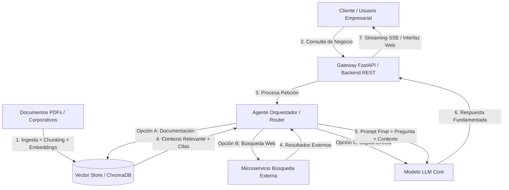

# Enterprise Neural Analyst 🧠⚡
> **Plataforma Empresarial de Análisis Documental Basada en RAG Híbrido y Agentes Autónomos**

---

## 🏢 Planteamiento del Problema Empresarial

En el entorno corporativo moderno, las organizaciones acumulan diariamente volúmenes masivos de información no estructurada: reportes financieros, manuales operativos, normativas legales, auditorías y políticas internas en formato PDF y Office.

Esta sobrecarga de datos genera tres grandes cuellos de botella operativos:

1. **Incapacidad de Búsqueda Semántica:** Los sistemas de gestión documental tradicionales se limitan a búsquedas por palabras clave exactas (*keyword search*), perdiendo contexto y omitiendo respuestas críticas.
2. **Ineficiencia y Costos Operativos:** Un analista promedio invierte hasta el **20% de su jornada laboral** localizando y contrastando información dispersa en múltiples archivos de más de 100 páginas.
3. **Riesgo de Alucinación en IA Convencional:** Intentar usar LLMs comerciales sin una capa de recuperación adecuada introduce el riesgo de "alucinaciones" e invención de datos, algo inaceptable en auditorías, contratos o decisiones corporativas.

---

## 🚀 La Solución: Enterprise Neural Analyst

**Enterprise Neural Analyst** es una solución de arquitectura **RAG Híbrido (Retrieval-Augmented Generation)** diseñada para transformar repositorios documentales pasivos en un motor de inteligencia activa. 

El sistema garantiza:
* **Gobernanza y Precisión:** Respuestas fundamentadas strictly en la documentación cargada por la empresa, acompañadas de **citas directas y número de página/fuente**.
* **Agentes Autónomos:** Enrutamiento inteligente que evalúa si la consulta requiere análisis documental profundo, búsqueda externa o procesamiento de lógica.
* **Privacidad de Datos:** Infraestructura modular capaz de conectarse a bases de datos vectoriales privadas sin exponer información confidencial de la organización.

---

## 📐 Arquitectura del Sistema

### 🔍 Glosario de Conceptos de la Arquitectura

* **Chunking (Fragmentación):** Proceso de dividir documentos extensos (PDFs de 100+ páginas) en bloques de texto más pequeños y manejables (ej. 500 palabras) manteniendo la coherencia semántica para no saturar el contexto del modelo.
* **Embeddings (Vectores Semánticos):** Conversión de los fragmentos de texto en vectores numéricos de alta dimensión. Permiten al sistema entender el *significado* e *intención* del texto en lugar de buscar coincidencias exactas de palabras.
* **Vector Store / Base de Datos Vectorial (ChromaDB/Qdrant):** Base de datos optimizada para almacenar y realizar búsquedas matemáticas por similitud cosenoidal entre vectores en cuestión de milisegundos.
* **Router / Agente Orquestador:** Componente con lógica condicional que analiza la intención de la pregunta del usuario y decide automáticamente la mejor vía de ejecución (consultar documentos internos, buscar en la web o responder con lógica pura).
* **Streaming SSE (Server-Sent Events):** Protocolo de comunicación unidireccional en tiempo real que permite enviar la respuesta del LLM token por token hacia la interfaz web, reduciendo la latencia percibida por el usuario.

---

## 🛠️ Stack Tecnológico

* **Orquestación & IA:** Python, PyTorch, Transformers.
* **Vector Store & Ingesta:** ChromaDB / Qdrant, Embeddings Multilingües.
* **Backend REST API:** FastAPI, Pydantic, Server-Sent Events (SSE).
* **Modelos:** Qwen 2.5 / Llama 3 / DeepSeek.
